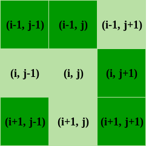

# The Game Of Life

## 📄 Overview
🏡 This project implements an interactive version of the classic simulation game, *John Conway's Game of Life*, using Pygame. The game allows users to select different starting patterns from classic configurations (like the *glider*, *small exploder*, and others) stored in a JSON file. A user-friendly interface lets users preview and choose their preferred configuration before launching the simulation.

🤔 The game's objective is to simulate the evolution of cells on a grid based on simple rules, which lead to complex and intriguing patterns. This project goes beyond simple simulation by offering a graphical interface where each user can select their starting pattern. This customization allows a better understanding of specific behaviors in each configuration, making the experience both educational and enjoyable.

This project is ideal for beginners in graphical programming with Python and for those interested in cellular automaton simulations. In addition to serving as a learning tool, the code is designed to be easily extensible, allowing the addition of new patterns or features, such as speed control and tracking initial configuration history.

🌐 Access the app and start your exploration now at [@Not implemented yet](https://wikipedia.com).

### Game Rules
Conway's Game of Life is a cellular automation method created by John Conway. Originally inspired by biological concepts, this game has been applied in various fields such as graphics, terrain generation, and more.

The "game" is a zero-player game, meaning its evolution is determined by its initial state and requires no further input. One interacts with the Game of Life by creating an initial configuration and observing how it evolves, or, for "advanced players," by creating patterns with specific properties.

Since the Game of Life is structured on a grid of nine cells, each cell has eight neighboring cells, as shown in the provided figure. A given cell (i, j) in the simulation can be accessed on a grid [i][j], where i and j are the row and column indices, respectively. The value of a given cell at any moment depends on the state of its neighbors in the previous time step. Conway's Game of Life has four rules:

- If a cell is ON and has fewer than two ON neighbors, it turns OFF.
- If a cell is ON and has two or three neighbors that are ON, it remains ON.
- If a cell is ON and has more than three neighbors that are ON, it turns OFF.
- If a cell is OFF and has exactly three neighboring cells that are ON, it becomes ON.



## Prerequisites

- **Anaconda or Miniconda**: For easy environment management (optional)
- **Docker** (optional): To run the app in a containerized setup
- **Python 3.12**

## ⚙️ Installation and Setup

This project uses **Poetry** for dependency management, which offers an option to create virtual environments directly. You have two choices to set up your environment:

### Option 1: Using Poetry to Create and Manage the Virtual Environment

Poetry can handle the creation and activation of a virtual environment automatically, without needing Conda or other virtual environment tools.

#### Steps

1. **Clone the repository**:
    ```bash
    git clone https://github.com/LudovicGardy/game_of_life
    cd game_of_life
    ```

2. **Install Dependencies and Create the Environment**:
   - If there is no `pyproject.toml` file in your project yet, you can create one using:
     ```bash
     poetry init
     ```

   - Add the libraries you need, for exemple:
     ```bash
     poetry add pygame
     ```

   - Run the following command to let `poetry` create an isolated environment and install dependencies directly:
     ```bash
     poetry install --no-root
     ```

3. **Activate the Environment**:
   - Poetry automatically creates a virtual environment, but it may not activate it by default. Use the following command to activate it:
     ```bash
     poetry shell
     ```

4. **Run the Application**:
   - **To run the full application**:
     ```bash
     python main.py
     ```
   - **To run a simplified version**:
     ```bash
     cd simple_version
     python main.py
     ```

#### Note on Poetry-managed Environments

Using `poetry install` to create and activate an environment directly is a streamlined approach, making Conda unnecessary. This can be ideal if you want a simple, Python-only virtual environment managed by `poetry`.

---

### Option 2: Using Conda for Virtual Environment Management

If you prefer using Conda, follow these steps:

#### Steps

1. **Clone the repository**:
    ```bash
    git clone https://github.com/LudovicGardy/game_of_life
    cd game_of_life
    ```

2. **Create and Activate the Conda Environment**:
   - **Using Conda** (recommended):
       ```bash
       conda create -n myenv python=3.11
       conda activate myenv
       ```

3. **Install Dependencies**:
   1. **With Poetry**
   - Once the environment is active, install dependencies within it:
     ```bash
     poetry install --no-root
     ```
   1. **Or with pip**
      ```bash
      pip install -r requirements.txt
      ```

4. **Run the Application**:
   - **To run the full application**:
     ```bash
     python main.py
     ```
   - **To run a simplified version**:
     ```bash
     cd simple_version
     python main.py
     ```

---

### Option 3: Run the App with Docker

If you prefer to run the application in a containerized setup, use Docker.

#### Steps

1. **Set Up Docker Environment**

   - Make sure **Docker** is installed and running on your system.

2. **Navigate to the Correct Directory**

   - **For a multi-container setup**:
     ```bash
     cd [path-to-app-folder-with-docker-compose.yml]
     ```

   - **For a single container**:
     ```bash
     cd [path-to-app-folder-with-Dockerfile]
     ```

3. **Build and Start the Containers**

   - Run the following command to build and launch the app in Docker:
     ```bash
     docker-compose up --build
     ```

   - **Access the Application**:
     - Open your browser and go to `http://localhost:8501`.

   - **Troubleshooting**:
     - If there’s an issue with `pymssql`, try adjusting its version in `requirements.txt` or temporarily removing it.

---

## 🧪 Running Unit Tests

Poetry can also manage unit tests to help you verify that the application functions as expected. This project uses **pytest** for testing.

### Setting Up and Running Tests

1. **Add Testing Dependencies**:

   If `pytest` and other test dependencies are not yet added, include them using Poetry:
   ```bash
   poetry add --dev pytest
   ```

2. **Writing Tests**:

   - Place your test files in a `tests` directory at the root of the project.
   - Name your test files following the pattern `test_*.py`.

3. **Running Tests**:

   To run tests within the Poetry environment, use:
   ```bash
   poetry run pytest
   ```

   Alternatively, if you are in an activated Poetry shell (`poetry shell`), you can simply run:
   ```bash
   pytest
   ```

4. **Viewing Test Results**:

   - Test results will appear in the terminal, with a summary of passed, failed, and skipped tests.
   - Use `pytest -v` for more detailed output.

---

## 👤 Author

- **LinkedIn**: [Ludovic Gardy](https://www.linkedin.com/in/ludovic-gardy/)
- **Website**: [https://www.sotisanalytics.com](https://www.sotisanalytics.com)