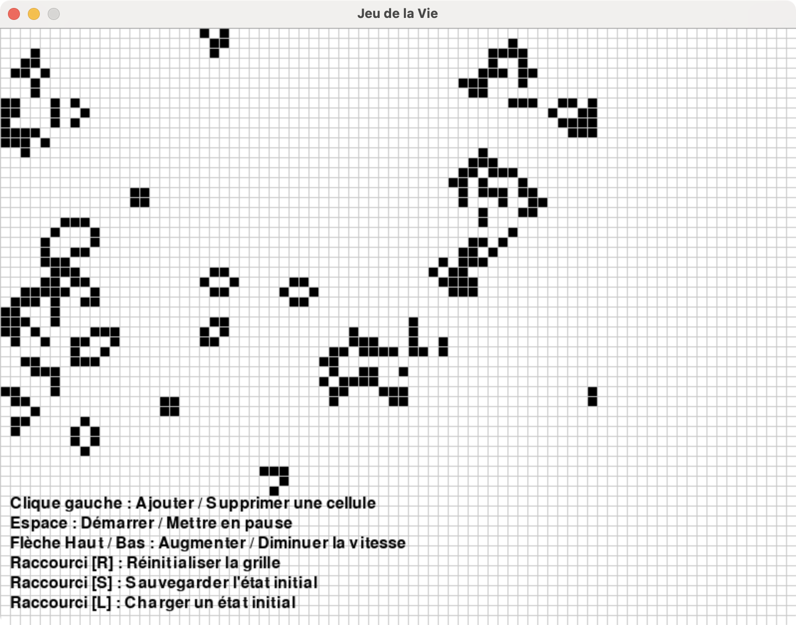

# The Game Of Life

## 📄 Overview
🏡 This project implements an interactive version of the classic simulation game, *John Conway's Game of Life*, using Pygame. The game allows users to select different starting patterns from classic configurations (like the *glider*, *small exploder*, and others) stored in a JSON file. A user-friendly interface lets users preview and choose their preferred configuration before launching the simulation.

🤔 The game's objective is to simulate the evolution of cells on a grid based on simple rules, which lead to complex and intriguing patterns. This project goes beyond simple simulation by offering a graphical interface where each user can select their starting pattern. This customization allows a better understanding of specific behaviors in each configuration, making the experience both educational and enjoyable.

This project is ideal for beginners in graphical programming with Python and for those interested in cellular automaton simulations. In addition to serving as a learning tool, the code is designed to be easily extensible, allowing the addition of new patterns or features, such as speed control and tracking initial configuration history.

🌐 Access the app and start your exploration now at [@Not implemented yet](https://wikipedia.com).

### Game Rules
Conway's Game of Life is a cellular automation method created by John Conway. Originally inspired by biological concepts, this game has been applied in various fields such as graphics, terrain generation, and more.

The "game" is a zero-player game, meaning its evolution is determined by its initial state and requires no further input. One interacts with the Game of Life by creating an initial configuration and observing how it evolves, or, for "advanced players," by creating patterns with specific properties.

Since the Game of Life is structured on a grid of nine cells, each cell has eight neighboring cells, as shown in the provided figure. A given cell (i, j) in the simulation can be accessed on a grid [i][j], where i and j are the row and column indices, respectively. The value of a given cell at any moment depends on the state of its neighbors in the previous time step. Conway's Game of Life has four rules:

- If a cell is ON and has fewer than two ON neighbors, it turns OFF.
- If a cell is ON and has two or three neighbors that are ON, it remains ON.
- If a cell is ON and has more than three neighbors that are ON, it turns OFF.
- If a cell is OFF and has exactly three neighboring cells that are ON, it becomes ON.

|  |  |
|:---------------------:|:---------------------:|
|Kernel|Application|

---

Bien sûr ! Voici une version simplifiée de la section **Setup & Usage** pour une application Python **sans Docker**, **sans `uv`**, **sans Streamlit**, et en utilisant uniquement un `requirements.txt` classique avec une gestion manuelle de l’environnement virtuel via `venv`.

---

## ⚙️ Setup & Usage

This version assumes a classic Python setup with `venv` and `requirements.txt`. No `uv` or `poetry` here.

### 🔧 Steps

1. **Make sure Python 3.11+ is installed**

   You can check your version with:
   ```bash
   python --version
   ```

2. **Clone the repository**
   ```bash
   git clone https://github.com/LudovicGardy/app_name
   cd app_folder/
   ```

3. **Create a virtual environment**
   ```bash
   python -m venv .venv
   ```

4. **Activate the virtual environment**

   - On **macOS/Linux**:
     ```bash
     source .venv/bin/activate
     ```

   - On **Windows** (PowerShell):
     ```powershell
     .venv\Scripts\Activate.ps1
     ```

5. **Install dependencies**
   ```bash
   pip install --upgrade pip
   pip install -r requirements.txt
   ```

6. **Run your application**

   Run the script or entry point of your app, for example:
   ```bash
   python main.py
   ```

---

## 🛠️ Development

### Pre-commit Hooks

This project uses pre-commit to maintain code quality. The following hooks are configured:

- **Basic hooks**: checking for trailing whitespaces, end-of-file formatting, YAML and TOML file verification, etc.
- **Ruff**: Python code linting and formatting
- **Codespell**: spell checking
- **Commitizen**: checking commit messages according to the defined convention

To install pre-commit:

```bash
# Install dependencies
uv pip install pre-commit ruff

# Install git hooks
pre-commit install
```

The hooks will run automatically with each commit. You can also run them manually:

```bash
pre-commit run --all-files  # Run on all files
pre-commit run ruff         # Run a specific hook
```

Ruff configuration is defined in `pyproject.toml` and includes:
- reStructuredText docstring format
- Import checking
- Double quote formatting
- Line length limited to 100 characters

---

## 👤 Author

- LinkedIn: [Ludovic Gardy](https://www.linkedin.com/in/ludovic-gardy/)
- Website: [https://www.sotisai.com](https://www.sotisai.com)
